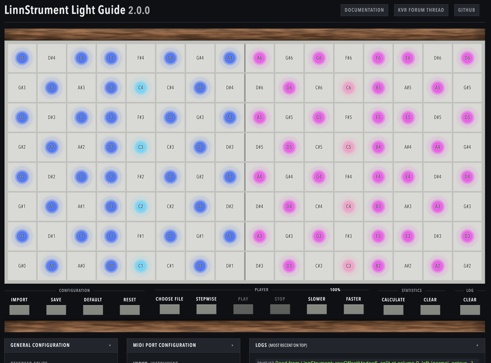

# LinnStrument Light Guide Support

## Description

This [web app](https://milesparker.github.io/linnstrument-light-guide/) allows you to visualize a
LinnStrument in a modern, [Web MIDI enabled browser](https://caniuse.com/midi). It shows the
notes you are currently playing, and guide notes — the notes you are meant to play — both on
screen and on the instrument itself. It can then compare the two, and tell you what you missed
and what you played late.

Guide notes can come from another program. Some keyboard learning tools like
[Synthesia](https://synthesiagame.com/) offer a "Light Guide" feature for certain keyboards.
LinnStrument is not directly supported by Synthesia, but with this app it is still possible to
use the light guide feature — see the [User Guide for Synthesia](#synthesia). In principle this
app works with any Light Guide source that sends MIDI notes or Light Guide messages, such as
[Scaler 2](#scaler-2). That route needs a virtual MIDI loop port to carry the notes across.

They can also come from the app itself. Open a MIDI file and it plays it straight into the
Light Guide, with no loop device, no DAW and nothing else running. You can take it down to a
quarter speed while it plays, and bring it back up as the passage comes together.

And it does not have to run to a clock at all. In [step mode](#step-mode) the app lights one
chord and waits: the piece moves when you play it, not when the bar line says so. Each lit pad
tells you what to do with it rather than only that it belongs to the chord — strike this one,
keep holding that one, let this one come up because the next step strikes it again. It is the
difference between a light guide you follow and one that follows you.

Underneath, the app matches itself to your instrument rather than the other way around. It asks
the LinnStrument for its own layout — split point, transposition, row offset, left handed
operation, note light colors — so the pad lit on screen is the pad under your finger. It also
knows which shapes the LinnStrument's sensor can read at once, and places a chord so that a
step never waits on a note the instrument was never going to send.

### Contributors

Simon Heimler wrote the original implementation.
Miles Parker contributed additional features, see RELEASE_NOTES.md for details.

> The original README, describing this project as the Light Guide bridge it began as, is kept
> verbatim at [OLD_README.md](./OLD_README.md).

## Pictures and GIFs

The layout above was read off the instrument, not typed in: a split at column 9, with each
side showing its own Note Lights colors.

 

## User Guide

### Matching Your LinnStrument

The app has to know which pitch each pad plays before it can light the right one. It reads
that from the instrument itself, so there is nothing to type in.

Pick your LinnStrument under **Input: Instrument** and **Output: Instrument**. Both are
needed: the app asks over the output port and the answers come back on the input port. It
reads once on startup, and again whenever you press **Import** under Configuration.

Until an instrument answers, the surface is shown unlit, with a note over it saying so. A
guessed layout would light the wrong pads, so the app shows none rather than an instrument
you do not have.

What it reads: the note and row offsets, the split point and per-split transposition, left
handed operation, the tempo, and your Note Lights colors. Change any of those on the
LinnStrument and press **Import** to catch up.

Three things the instrument cannot tell the app, so they are settings instead:

* **LinnStrument Size** — 128 or 200.
* **Reversed Splits** — the LinnStrument reports that left handed operation is on, but not
  which splits it applies to. Set this to match your `REV` / `REVL` / `REVR`.
* **Duplicate Note Pads** — the same note sits on several pads at once, and lighting every
  one of them turns a chord into a wash. The default lights only the pad nearest the middle
  of each split. Any pad still plays the note; this only changes which one lights up.

Settings are kept in your browser. **Save** applies them and lights up while you have
unsaved changes, **Default** puts them back, and **Reset** clears every highlight on the
visualization and the instrument.

### Playing a MIDI File

Press **Choose File** under Player and pick a `.mid` file from your computer. Then **Play**.

The file's notes are lit as guide notes, exactly as if they had arrived over a MIDI port, so
everything else — the comparison against what you play, the statistics, the feedback colors —
works the same way. The file name and the current speed are shown above the Player keys.

* **Slower** / **Faster** move between 25% and 200% of the file's own tempo. It takes effect
  straight away, mid-song too, so you can take a hard bar right down without stopping. The
  speed is remembered between sessions.
* **Stop** ends playback and puts the lights out.
* Drums are ignored (GM channel 10), so a kick and snare track does not flash pads at you.

If you have a split and the file keeps its hands on separate tracks or channels, turn on
**Route Parts To Hands**. Each note then lights under the hand whose part plays it, read from
the file rather than guessed from pitch — so a melody that dips below the accompaniment stays
in the right hand instead of jumping across the split.

### Step Mode

Tick **Stepwise** before pressing Play. Instead of running in time, the app lights one chord
and waits. When you have played it, it lights the next one. There is no clock and nothing to
keep up with: the piece moves at the speed you play it.

Two keys change in step mode, because tempo no longer means anything:

* **Back** replaces Slower — go back a step and play it again.
* **Next** replaces Faster — move on without playing the step.

The readout above the keys shows how far through you are rather than a percentage.

A step turns once every note in it is held down at the same time. Notes that *start* on this
step need a press of their own, so a chord you are already holding does not skip ahead; notes
carried over from the step before just need to still be down.

#### Reading the Colors

Each lit pad says what to do with it, not just that it is part of the chord. The defaults:

| Color | What it means |
| --- | --- |
| **Yellow** — Light Guide Note Color | Strike it now. It ends with this step. |
| **Orange** — Step: Held Note Color | Do not lift it. Either it is already down, or it carries on past this step. |
| **Lime** — Step: Repeat Note Color | The next step strikes this note again, so let the pad come up and play it afresh when the step turns. |
| **Green** — Step: Next Step Color | A look ahead at what the next step will strike. Not to be played yet; the step does not wait for it and it does not count against you. |
| **Red** — Step: Wrongly Held Color | You are holding a pad this step has no note for. Lift it. |

Every one of these can be set to another color, or switched off to fall back to how step mode
looked without it.

Orange is the one color that stays slightly ambiguous: a note already down that ends with this
step looks the same as one that carries on past it. **Step: Next Step Outlines** settles it by
outlining the pads that are held on into the next step. That is drawn on the visualization only,
since the LinnStrument has no way to outline a pad.

> The LinnStrument lights the pads you touch itself, using its own `COLOR / PLAYED` setting. If
> that is on, it will paint over the red "lift this" color. Set `COLOR / PLAYED` to off on the
> instrument to see it.

#### When a Chord Will Not Fit

The LinnStrument's surface is a scanned matrix rather than one sensor per pad, so some shapes
cannot be read. Two combinations in particular are dropped by the firmware: a fourth touch in
the same column, and the four corners of a rectangle. These are limits of the sensing method,
not settings, and they are described in [Roger Linn's FAQ](https://www.rogerlinndesign.com/support/support-linnstrument-faqs).

This matters in step mode, because a step waits for a chord to be held. A chord lit on a shape
the instrument cannot read would never complete, and the step would just sit there.

So the app places each chord on pads that can be read together, using the duplicate pads a note
already has. Usually you will not notice. When it has to do something you can see, it says so in
the log:

* A note may light under the *other* hand, if its own side has no pad left that works alongside
  the rest of the chord.
* A note may be left dark, if there is nowhere for it at all. The step does not wait for it, so
  play what is lit and it will move on.

### Any MIDI Source

In principle any MIDI source can be selected as Light Guide input in the app. The MIDI note-on and note-off events from that source will then be visualized and the played notes compared against it. 
For an example, see [Scaler 2](#scaler-2).

### Scaler 2

I found [Scaler 2](https://www.scalerplugin.com/) to be a very useful input source for Light Guide notes as well. 
It can play chords but also patterns based on the chords.  

* You need to have a virtual MIDI Loop Device (e.g. loopMIDI) through which Scaler 2 can send its MIDI out to this app.
  * On Windows you can use a tool like [loopMIDI](https://www.tobias-erichsen.de/software/loopmidi.html)
  * You need to setup two MIDI loop ports,
    * One where Scaler 2 can send its MIDI output to, e.g. with the name `Loop Back A`
    * One where the app can send back the received LinnStrument MIDI notes back (like MIDI Thru) to a VSTi, so you can hear your own notes, e.g. `Loop Forward A`
* Start the app and configure 
  * `Input: Light Guide` to use previously setup loop port (e.g. `Loop Back A`)
  * `Forward: MIDI Thru 1` to forward the LinnStrument notes to the DAW VSTi for your own sound (e.g. `Loop Forward A`)
* Start a DAW of your choice and setup two tracks:
  * Load Scaler 2 and route its MIDI outport to the `Loop Back A` device
  * Load a VSTi of your choice and use the MIDI Thru port as input, e.g. `Loop Forward A`
* Tip: Also add some drums or other backing track elements and use your DAW time, play and stop controls. 

### Synthesia

Setting this up with Synthesia is a bit fiddly, as it needs a few MIDI loop devices to route MIDI information from and to the right places.
Personally, I'm also using a DAW to hear my own notes, synthesia notes and drums / metronome with low latency.

* You need to have a virtual MIDI Loop Device (e.g. loopMIDI) where Synthesia sends KeyLights to the Output.
  * On Windows you can use a tool like [loopMIDI](https://www.tobias-erichsen.de/software/loopmidi.html)
  * You need to setup at least two Loop ports:
    * One for receiving forwarded LinnStrument MIDI notes (This scripts defaults to `Loop Forward A`)
    * One for sending Synthesia Light Guide information (This scripts defaults to `Loop Back C`)
  * Personally, I've set up three more Loop Devices, so I can use my DAW to hear / mix everything with low latency:
    * One for sending Synthesia background MIDI (teachers piano) to my DAW (`Loop Back A`)
    * One for sending Synthesia drum & metronome MIDI (teachers piano) to my DAW (`Loop Back B`)
    * One for sending LinnStrument MIDI notes to the DAW (`Loop Forward B`)

* Optionally: Setup a DAW to hear your own and Synthesias sounds in real-time without latency. I've setup three tracks:
  * Own Piano: Listens to `Loop Forward B` (which is the MIDI Thru of LinnStrument)
  * Teachers Piano: Listens to `Loop Back A` to play Synthesia notes
  * Drums & Metronome: Listens to `Loop Back B` to play Synthesia drum and metronome sounds

* Configure Synthesia Music Input:
  * Receive player notes from `Loop Forward A`

* Configure Synthesia Music Output:
  * Send "Key Lights" to `Loop Back C`, using the "ONE Smart Piano" or any of the channels mode, e.g. "Finger-based channel".
    * The "ONE Smart Piano" option seems to work most reliable?
  * Optional: Send "Background" to `Loop Back A`.
  * Optional: Send "Percussion, Metronome" to `Loop Back B`.

Now everything should be ready. Start the webapp at https://milesparker.github.io/linnstrument-light-guide/.
Make sure to use a modern browser that supports WebMIDI like Google Chrome or MS Edge.

Make sure that the configuration is correct and matches your MIDI input and output ports.

Have fun :)

## TODO and Ideas

* Create a GitHub issue in this project if you have an idea or run into a problem.

## Developer Guide

* Install Node.js if not there
* Check out this repository
* Run `npm install`
* Run `npm run build` (to copy over dependencies to webapp)
* Run `npm start` (serves `./web` on http://localhost:8080)
* Run `npm test`

The tests cover the parts that have no browser in them: the pad-to-pitch mapping ported from
the firmware (`web/src/layout.js`), which hand a note belongs to (`web/src/parts.js`), and
what the sensor can read at once (`web/src/reach.js`). They run on Node's own test runner,
with no dependencies to install beyond the ones above.
